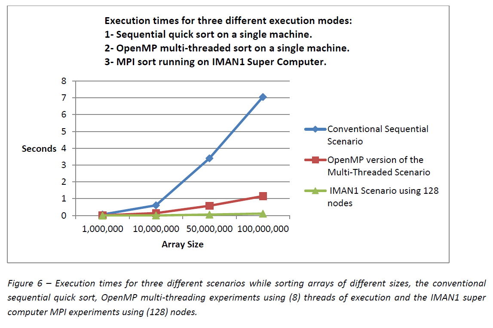
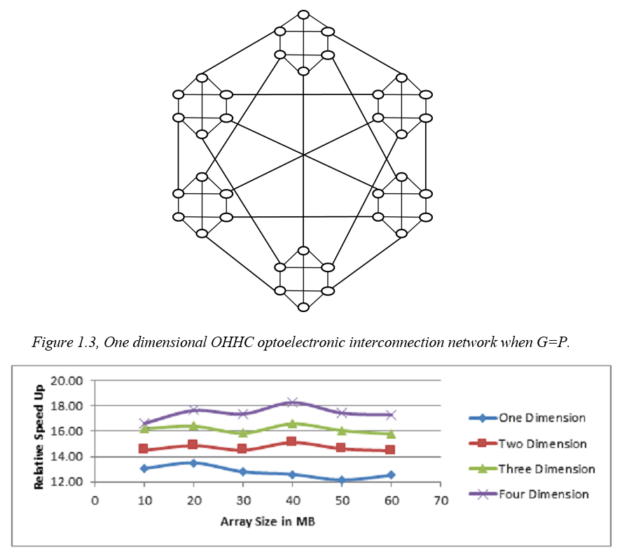

# Contents

## Quicksort on Super Computer
compares the performance of sequential sorting algorithms under four different modes of execution, the sequential processing mode, a conventional multi-threading implementation, multi-threading with OpenMP Library and finally parallel processing on a super computer [Iman1 Super Computer](http://www.iman1.jo/iman1/)
Quick Sort algorithm was selected to run the experiments performed by this effort and the algorithm was run using different arrays sizes and different number of processors. The results and findings were analyzed uncovering limitations as well as enhancement potentials of sequential sorting algorithms using parallelism.

## Hyper Hexa Cell, Load balancing algorithms for the HHC interconnection-network
This work presents three different HHC load-balancing algorithms and evaluates them using several metrics such as Complexity, Communication Steps, Speed, and error probability. 

## Implementing Parallel Quick Sort on OTIS Hyper Hexa-Cell (OHHC) interconnection network
Presents a parallel Quick Sort algorithm implemented over the OTIS Hyper Hexa-Cell interconnection network (OHHC) to explore and detect its characteristics. OHHC interconnection architecture offers efficient processor connectivity by utilizing both electronic and optical based connections. The work presented includes analytical evaluation of the algorithm as well as simulated evaluation based on multi-threading environment. Different experiments were performed using different (OHHC) dimensions, different integer array types (random, sorted…etc.) and different array sizes. The evaluation and simulation demonstrated encouraging results unveil the (OHHC) connectivity networks as one of the promising architectures. Result showed improvement in relative speedup up to 20% for OHHC full group and OHHC half group. Efficiency improvement reached up to 40% for the OHHC full group and 30% for the OHHC half group.

